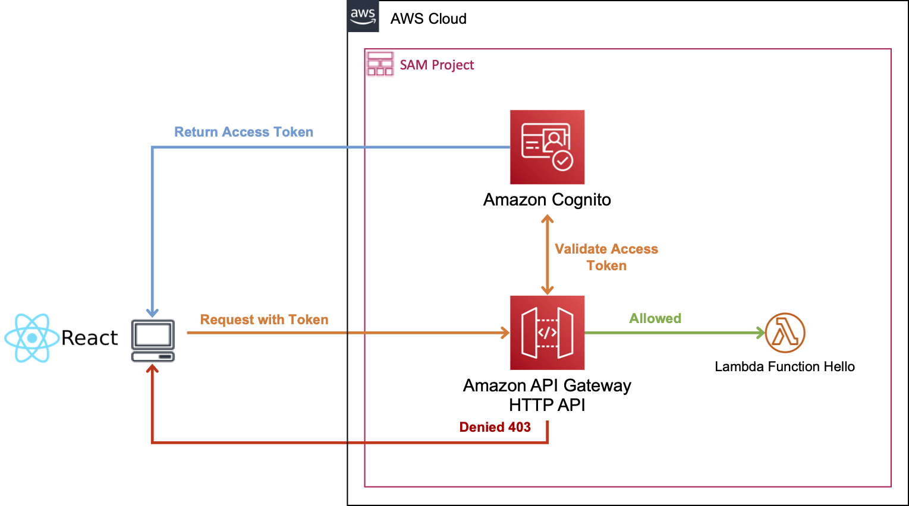
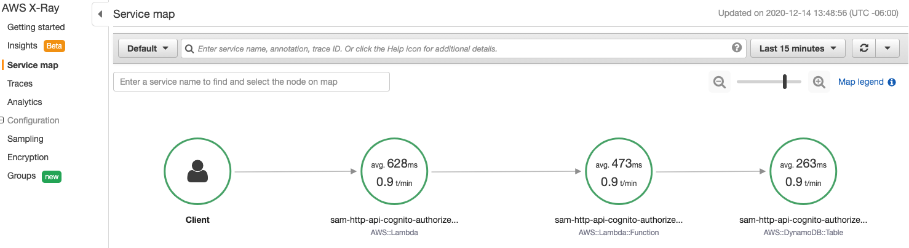

# SAM - API Gateway HTTP API with Cognito Authorizer



## Prerequisites

* [React application with Amazon Cognito created with Amplify](https://github.com/aurbac/amplify-react-app)

## Deploy the SAM application

Based on the `AWS Quick Start Template` update the **[template.yml](template.yml)** and replace the files for the **[hello-world](hello-world)** code function.

To build your application run the following using a docker container:

```bash
sam build --use-container
```

To deploy your application for the first time, run the following and specify the Cognito and App information:

```bash
sam deploy --guided
```

* Stack Name [sam-app]: **sam-http-api-cognito-authorizer**
* AWS Region [us-east-1]: **<aws_cognito_region>** (Your AWS Region, you can find it in your Amplify project at **src/aws-exports.js**)
* Parameter UserPoolId []: **<aws_user_pools_id>** (Your User Pool Id, you can find it in your Amplify project at **src/aws-exports.js**)
* Parameter ClientId []: **<aws_user_pools_web_client_id>** (Your Web Client Id, you can find it in your Amplify project at **src/aws-exports.js**)
* Parameter AllowOrigin []: **<UrlApplication>** (You can use your Cloud9 URL or you CloudFront domain of your Amplify application).
#Shows you resources changes to be deployed and require a 'Y' to initiate deploy
* Confirm changes before deploy [y/N]: **y**
#SAM needs permission to be able to create roles to connect to the resources in your template
* Allow SAM CLI IAM role creation [Y/n]: **y**
* Save arguments to configuration file [Y/n]: **y**
* SAM configuration file [samconfig.toml]: 
* SAM configuration environment [default]: 

## Testing the API inside your React application with Amplify

In you Amplify project replace your **src/App.js** with the following file [src/App.js](amplify/src/App.js) and **src/index.js** with the following file [src/index.js](amplify/src/index.js).

For **src/index.js** replace: `<HttpApiUrl>` and `<Region>` with your own values.

## View AWS X-Ray service maps and trace views

You can see in AWS X-Ray information about your API and all of its downstream services, for this project you can see something like this:



## References

* [SAM - AWS::Serverless::HttpApi](https://docs.aws.amazon.com/serverless-application-model/latest/developerguide/sam-resource-httpapi.html).
* [Working with HTTP APIs](https://docs.aws.amazon.com/apigateway/latest/developerguide/http-api.html)
* [Using AWS X-Ray service maps and trace views with API Gateway](https://docs.aws.amazon.com/apigateway/latest/developerguide/apigateway-using-xray-maps.html)